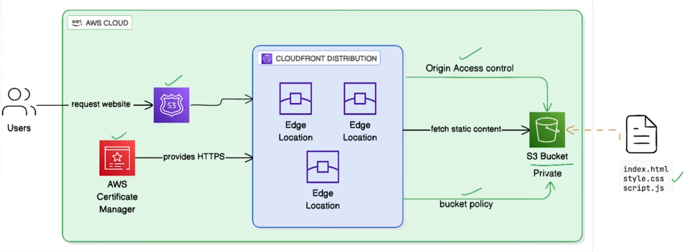

# Host a Static Website on AWS S3 + CloudFront using Terraform

A production-style Terraform project that deploys a static website to AWS using S3 (private bucket) and CloudFront CDN with Origin Access Control (OAC).

---

## Architecture



```
Browser → CloudFront (HTTPS) → OAC (SigV4 Signed Request) → S3 (Private Bucket)
```

- S3 bucket is fully private — no direct public access
- All traffic goes through CloudFront
- CloudFront signs every request to S3 using OAC + SigV4
- HTTPS enforced — HTTP requests are redirected automatically

---

## Project Structure

```
terraform-s3-cloudfront/
├── main.tf                        # Root: calls all modules
├── variables.tf                   # Input variables
├── outputs.tf                     # CloudFront URL, bucket name, distribution ID
├── providers.tf                   # AWS provider configuration
├── terraform.tfvars               # Your variable values
│
├── modules/
│   ├── s3/
│   │   ├── main.tf                # S3 bucket, versioning, encryption, OAC policy
│   │   ├── variables.tf
│   │   └── outputs.tf
│   ├── cloudfront/
│   │   ├── main.tf                # CloudFront distribution + OAC
│   │   ├── variables.tf
│   │   └── outputs.tf
│   └── upload/
│       ├── main.tf                # Uploads HTML, CSS, JS to S3
│       ├── variables.tf
│       └── outputs.tf
│
└── website/
    ├── index.html
    ├── style.css
    └── app.js
```

---

## AWS Resources Created

| Resource | Purpose |
|---|---|
| `aws_s3_bucket` | Stores website files (private) |
| `aws_s3_bucket_versioning` | Keeps file history for rollback |
| `aws_s3_bucket_public_access_block` | Blocks all direct public access |
| `aws_s3_bucket_server_side_encryption_configuration` | Encrypts files at rest (AES-256) |
| `aws_s3_bucket_policy` | Allows only CloudFront OAC to read files |
| `aws_cloudfront_origin_access_control` | Signs S3 requests using SigV4 |
| `aws_cloudfront_distribution` | CDN that serves the website globally |
| `aws_s3_object` (x3) | Uploads index.html, style.css, app.js |

**Total: 10 resources**

---

## Prerequisites

- [Terraform](https://developer.hashicorp.com/terraform/install) >= 1.0
- AWS account with an IAM user configured
- AWS CLI configured (`aws configure`)
- IAM user must have these policies attached:
  - `AmazonS3FullAccess`
  - `CloudFrontFullAccess`

---

## Usage

**1. Clone the repository**

```bash
git clone https://github.com/your-username/terraform-s3-cloudfront.git
cd terraform-s3-cloudfront
```

**2. Update variable values**

Edit `terraform.tfvars`:

```hcl
aws_region   = "us-east-1"
project_name = "your-unique-project-name"
environment  = "dev"
```

> `project_name` must be globally unique — it becomes part of the S3 bucket name.

**3. Initialize Terraform**

```bash
terraform init
```

**4. Preview changes**

```bash
terraform plan
```

**5. Deploy**

```bash
terraform apply
```

Type `yes` when prompted. CloudFront deployment takes 5-10 minutes.

**6. Access your website**

Terraform prints the URL after apply:

```
Outputs:

cloudfront_url             = "https://xxxxxx.cloudfront.net"
cloudfront_distribution_id = "EXXXXXXXXXX"
s3_bucket_name             = "your-project-dev-website"
```

Open `cloudfront_url` in your browser.

---

## Updating Website Files

After changing any file in the `website/` folder:

```bash
# Re-upload files
terraform apply

# Invalidate CloudFront cache so changes are visible immediately
aws cloudfront create-invalidation \
  --distribution-id <cloudfront_distribution_id> \
  --paths "/*"
```

---

## Destroy Infrastructure

```bash
terraform destroy
```

> Run this when you no longer need the resources to avoid any charges.

---

## Key Concepts

**Why OAC instead of making S3 public?**
OAC (Origin Access Control) allows only your specific CloudFront distribution to read from S3 using signed requests. Direct S3 URLs return 403. This is the AWS-recommended approach as of 2023.

**Why `bucket_regional_domain_name` instead of `bucket_domain_name`?**
The regional endpoint is required for OAC. The global endpoint does not support SigV4 signing headers.

**Why `etag = filemd5(...)` on S3 objects?**
Without it, Terraform never detects file changes and skips re-uploads. The MD5 hash comparison forces Terraform to re-upload when file content changes.

**Why are 403 and 404 errors redirected to index.html?**
When a user visits a path like `/about`, S3 has no such file and returns 403/404. Redirecting to `index.html` lets the JavaScript router handle the path — required for SPAs.

---

## Tech Stack

- **Terraform** >= 1.0
- **AWS S3** — Static file storage
- **AWS CloudFront** — CDN + HTTPS + caching
- **AWS IAM** — OAC policy for secure S3 access
